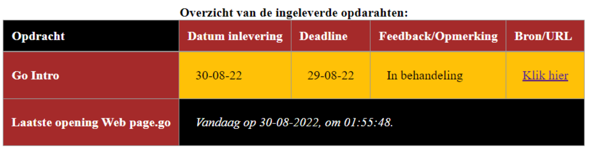

Voor de App-laag van dit semester nj-23 zijn hier alle opdrachten te vinden. GoLand applicatie (JetBrains) wordt gebruikt.

Om de Go Intro app werkend te krijgen; Download de laate release via https://github.com/x2ih/IntroGo_23nj/releases/tag/week1
1- Zorg dat je WebPage.go, index.html en assest bestanden in een map hebt. 
2- Gebruik localhost:8080 of 127.0.0.1:8080 in je browser nadat Web page.go is gedraaid.

Bij issues hoor ik het graag

